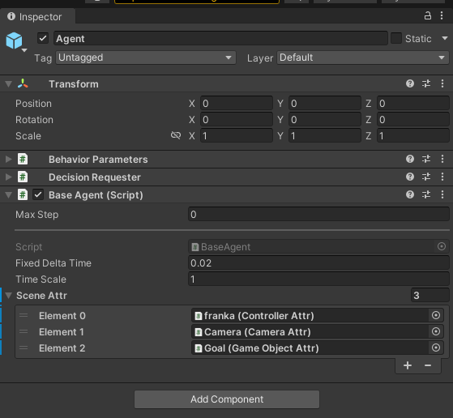

# Franka Robotics RL Environment Tutorial

_**This environment has been removed in RFUniverse Release 0.20 and the last available version is 0.13.0**_


From previous pages, you should have some basic knowledge and understanding on the data flow and API usage in RFUniverse. In the [example](first_example) mentioned ealier, we use the default unity executable file as the Unity side server and use pure python code to control and operate objects in Unity. Besides, we can also use Unity Editor to open our [Unity project](https://github.com/mvig-robotflow/rfuniverse) as the Unity side server. However, our built-in assets cannot be enough for every task in this world. Fortunately, RFUniverse leaves users enough freedom to create their own simulation environments and use their own robots to do anything they want.

In this tutorial, we will create a Franka robot environment for Reinforcement Learning. The python code will be in OpenAI-Gym style so that most RL algorithms can be used to train directly. The environment setting is inspired by [panda-gym](https://github.com/qgallouedec/panda-gym).

## Quick Start with prebuilt scene

For users who are not familiar with Unity Editor, we have built this scene in the latest version of [RFUniverse Release](https://github.com/mvig-robotflow/rfuniverse/releases). Please download it, follow [README](https://github.com/mvig-robotflow/rfuniverse/blob/main/README.md) to setup your environment and enjoy!

To use this environment, you can use the following code, which is also available [here](https://github.com/mvig-robotflow/pyrfuniverse/blob/main/Test/test_pick_and_place_gym.py).

```python
from pyrfuniverse.envs.robotics import FrankaRoboticsEnv

env = FrankaRoboticsEnv(
    # executable_file='@editor',
    scene_file='FrankaRobotics.json',
    max_episode_length=500,
    reward_type='sparse',
    seed=None,
    tolerance=0.05,
    load_object=True,
    target_in_air=True,
    block_gripper=False,
    target_xz_range=0.15,
    target_y_range=0.6,
    object_xz_range=0.15,
    asset_bundle_file=None,
    assets=['Rigidbody_Box']
)
env.reset()

while 1:
    obs, reward, done, info = env.step(env.action_space.sample())
    if done:
        env.reset()
```

## Build scene in Unity

(tutorial_requirements)=
### Requirements
1. Clone the RFUniverse Unity side repository.
```bash
    git clone https://github.com/mvig-robotflow/rfuniverse.git
```
2. Install the Unity Editor (>= 2021.3) and open the project cloned above.

### Create a new scene
First, navigate to `Assets/Scene` in `Project` window and create a new scene with any name (e.g. named `Franka-Robotics-RL`). Then double-click the scene file to open it in Editor.

### Add general prefab into the scene
In `Assets/RFUniverse/Assets/Prefab`, find a prefab named `RFUniverse` and drag it into the scene `Hierarchy` window. You can click the triangle on the left side of `RFUniverse` in `Hierarchy` window and see the following image.


The first object, `Agent`, will handle the communication between Python and Unity as well as some settings. The second object, `Main Camera`, is the camera in a scene to help visualize the scene. The last object, `Ground`, is a plane with texture. All these objects are useful in most scenes so we make them into one prefab.

After loading `RFUniverse` prefab, please remember to remove the original `Main Camera` and `Directional Light` since they have been included in the loaded prefab.

(create_goal)=
### Create the goal
Then, create a goal for visualizing. Just like the gifs in [panda-gym](https://github.com/qgallouedec/panda-gym), we also need a 'shadow' to show the target position, although this is only for people to see. Right click on the blank space in `Hierarchy` window and select `3D Object -> Cube`. You can name it `Goal`. Then, click on it and set the `Transform` value as the following image.


During training, this object will be controlled to change transform, so we have to add `Attr` components to it so that our commands will be heard by it. Since we only need to set transform to it, so a game object attribute is enough. Add the component by clicking on it, and click the `Add Component` button in `Inspector` window. Type in the `game object attr` in the text window and you will find the corresponding script. After adding the attr component, you can see an `id` entry below `Game Object Attr` title, which means this object should have a unique id so that we can find it. Type in any lucky number for you, e.g., 4321. And finally, since this cube is a 'shadow', it should not have colliders. Destroy the collider by clicking the object and right-click the `Box Collider` component in `Inspector` window and select `Remove Component`. After all these operations, the `Goal` object should look like this.


### Create Franka robot arm
Next, let's move on to add a Franka robot arm into the scene. In `Assets/Assets/Prefab/Controller/Arm`, find the prefab `franka` and drag it into the scene. You can unfold this object and see the hierarchical structure like the following image.


When you click any moveable part in Franka, you can find the corresponding components have been added. This is because we have made many robot arms prefabs and users can use them directly. If you want to use your own robot arm, just imitate the setting of our robot arms.

According to [panda-gym](https://github.com/qgallouedec/panda-gym), Franka should locate at position [0.6, 0, 0] in Unity coordinate, so we change the `Transform` component values accordingly.

### Add other objects

Finally, let's add other objects which will not communicate with Python, but may affect the training process.

In [panda-gym](https://github.com/qgallouedec/panda-gym), there's a work table under Franka, so we also create one here. Create another cube and set the `Transform` value according to the image below.


By default, the ground's position is [0, 0, 0], but Franka has a work table under it, and the ground is under the work table, so we need to change the position of ground. This is the advantage of simulation environment: you can set any object to any place! Let's set the position of the `Ground` in `RFUniverse` prefab to [0, -0.4, 0].

After all these settings, your scene should be similar to the following image except the color of `Goal` and the work table. The color setting (more precisely, [Material](https://docs.unity3d.com/Manual/Materials.html)) is left to users for discovery.


### Add Scene Attr to Agent

Here's the final step in scene building. Although we have added `Attr` components to many objects, they will not be able to communicate with Python until they are dragged into the `BaseAgent.SceneAttr` value in `Agent`. You can do this by clicking on `Agent` object, then drag the `franka`, `Camera` and `Goal` to `Scene Attr` under `Base Agent (Script)` in `Inspector` window. The final result is like the following.



## Write the python codes

The full version code is available [here](https://github.com/mvig-robotflow/pyrfuniverse/blob/main/pyrfuniverse/envs/robotics/franka_robotics_env.py). In this tutorial, we will go through the code and explain some key factors.

### Set up the environment

You may notice that we didn't create the manipulatable object in scene. Yes, because the object is built-in and we can load it using code. Of course you can also create it into the scene directly and add `Rigidbody Attr` components. But here we think it more convenient to load by Python.
We can load the object using the following code.

```python
def _env_setup(self):
    if self.load_object:
        self.asset_channel.set_action(
            'InstanceObject',
            name='Rigidbody_Box',
            id=0
        )
        self.instance_channel.set_action(
            'SetTransform',
            id=0,
            position=[0, self.height_offset, 0],
            scale=[0.05, 0.05, 0.05],
        )
    self.instance_channel.set_action(
        "SetIKTargetOffset",
        id=965874,
        position=[0, 0.105, 0],
    )
    self.instance_channel.set_action(
        "IKTargetDoRotate",
        id=965874,
        vector3=[0, 45, 180],
        duration=0,
        speed_based=False,
    )
    self._step()
```

Here, we instanciate the object and assign id 0 to it. Then, we set the IK target and move the Franka robot (whose id is 965874) to a given position.

### Observation

```python
def _get_obs(self):
    gripper_position = np.array(self.instance_channel.data[9658740]['positions'][3])
    gripper_velocity = np.array(self.instance_channel.data[9658740]['velocities'][3])
    gripper_width = self._get_gripper_width()

    panda_obs = np.concatenate((gripper_position, gripper_velocity, [gripper_width]))

    if self.load_object:
        object_position = np.array(self.instance_channel.data[0]['position'])
        object_rotation = np.array(self.instance_channel.data[0]['rotation'])
        object_velocity = np.array(self.instance_channel.data[0]['velocity'])
        object_angular_vel = np.array(self.instance_channel.data[0]['angular_vel'])
        achieved_goal = object_position.copy()
    else:
        object_position = object_rotation = object_velocity = object_angular_vel = np.zeros(0)
        achieved_goal = gripper_position.copy()

    object_obs = np.concatenate((object_position, object_rotation, object_velocity, object_angular_vel))

    obs = np.concatenate((panda_obs, object_obs))

    return {
        'observation': obs.copy(),
        'achieved_goal': achieved_goal.copy(),
        'desired_goal': self.goal.copy()
    }
```

There are two things need to explain here. 

First, id 9658740 didn't appear in the scene building process, what's it? The answer is, this is the Franka Gripper. In RFUniverse, if two articulations also have parent-child relationship, such as franka arm and franka gripper, the child id will be its parent id times 10. And you can see from the Unity Editor that Franka Gripper has four parts: `body`, `finger1`, `finger2` and `grasp_point`, here we only focus on the last part, so the index in the first two lines are 3.

The second one is the returned observation. Since we want to implement a goal-conditioned environment, the observation variable should be a dict include three keys: `observation`, `achieved_goal` and `desired_goal`. The achieved goal is the current position of object and the desired goal is the position of `Goal`.

### Step

```python
def step(self, action: np.ndarray):
    """
    Params:
        action: 4-d numpy array.
    """
    # print(action)
    pos_ctrl = action[:3] * 0.05
    curr_pos = np.array(self.instance_channel.data[9658740]['positions'][3])
    # print(curr_pos)
    pos_ctrl = curr_pos + pos_ctrl

    # print(pos_ctrl)
    self.instance_channel.set_action(
        "IKTargetDoMove",
        id=965874,
        position=[pos_ctrl[0], pos_ctrl[1], pos_ctrl[2]],
        duration=0.1,
        speed_based=True
    )

    if self.block_gripper:
        self._set_gripper_width(0)
    else:
        curr_gripper_width = self._get_gripper_width()
        target_gripper_width = curr_gripper_width + action[3] * 0.2
        target_gripper_width = np.clip(target_gripper_width, 0, 0.08)
        self._set_gripper_width(target_gripper_width)

    # self._set_franka_joints(np.array(joint_positions))
    self._step()
    self.t += 1

    obs = self._get_obs()
    done = False
    info = {
        'is_success': self._check_success(obs)
    }
    reward = self.compute_reward(obs['achieved_goal'], obs['desired_goal'], info)

    if self.t == self.max_steps:
        done = True

    return obs, reward, done, info
```

In `step()` function, we use a 4-d array in range [0, 1] to control the robot arm. The maximum movement in one step is 5cm. We should first control robot arm, then robot gripper, and finally use `self._step()` to wait for Unity finish its simulation. After simulation, we can get observation, compute reward and check success.

### Reset Franka robot and object

In `reset()` function, we should finish this episode and prepare for the next episode by setting all objects in scene to its original status. Here we first reset robot arm by resetting robot arm to init position and opening its gripper.

```python
    self.instance_channel.set_action(
        "IKTargetDoMove",
        id=965874,
        position=[self.init_pos[0], self.init_pos[1], self.init_pos[2]],
        duration=0,
        speed_based=False,
    )
    self._step()
    self.instance_channel.set_action(
        'SetJointPositionDirectly',
        id=9658740,
        joint_positions=[0.04, 0.04],
    )
    self._step()
```

Next, we reset object by setting it to a randomly sampled position.

```python
def _reset_object(self):
    object_pos = self.np_random.uniform(self.object_range_low, self.object_range_high)

    self.instance_channel.set_action(
        'SetTransform',
        id=0,
        position=list(object_pos),
        rotation=[0, 0, 0]
    )
    self._step()
    return object_pos.copy()
```

## Specify tasks

With the codes of `franka_robotics_env.py`, we can specify some parameters to support different tasks. For example, for `Reach` task, we should set `load_object=False`, `target_in_air=True` and `block_gripper=True`; for `Push` task, we should set `load_object=True`, `target_in_air=False` and `block_gripper=True`. The specified parameters and corresponding task can be found in [franka_robotics package](https://github.com/mvig-robotflow/pyrfuniverse/tree/main/pyrfuniverse/envs/robotics)
