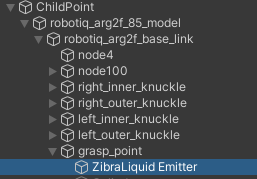
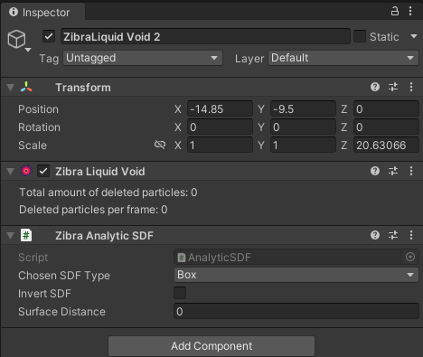
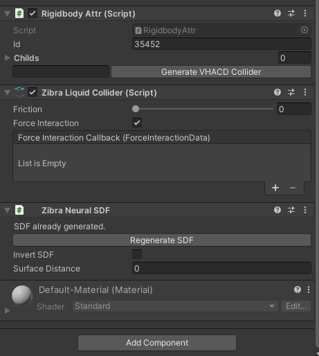

# UR5 Water Pushing RL Environment Tutorial

_**This environment has been removed in RFUniverse Release 0.20 and the last available version is 0.13.0**_


In this tutorial, we will continue the multi-physics attribute of RFUniverse and build an RL environment for simulating a UR5 robot grasping a water pipe. The UR5 agent should be trained to move to correct position and make the water push a cube to its target range. This environment is also RL-supported and codes will be in OpenAI-Gym style.

Warning: The plug-in of this scene is only available on Windows platform. If your algorithm needs to run on Linux, we recommend using [Windows WSL](https://learn.microsoft.com/en-us/windows/wsl/install) as the algorithm-end and Windows for the simulation-end. In this way, you do not need to modify any code.

## Quick Start with prebuilt scene

For users who are not familiar with Unity Editor, we have built this scene in the latest version of [RFUniverse Release](https://github.com/mvig-robotflow/rfuniverse/releases). Please download it, follow [README](https://github.com/mvig-robotflow/rfuniverse/blob/main/README.md) to setup your environment and enjoy!

To use this environment, you can use the following code, which is also available [here](https://github.com/mvig-robotflow/pyrfuniverse/blob/main/Test/test_water_shooting_gym.py).

```python
from pyrfuniverse.envs.multi_physics import UR5WaterShootingEnv

env = UR5WaterShootingEnv(urdf_file='../Mesh/UR5/ur5_robotiq_85.urdf')
env.reset()

while 1:
    obs, reward, done, info = env.step(env.action_space.sample())
    if done:
        env.reset()
```

## Build scene in Unity

First of all, just like the previous tutorials, we must setup the scene in Unity Editor. In this experiment, we will use a UR5 robot as the agent. But the most important part is to use Zibra Liquid to simulate water and interact with a rigid cube. We will look in the process step by step.

### Requirements

1. Clone the RFUniverse Unity side repository.
```bash
    git clone https://github.com/mvig-robotflow/rfuniverse.git
```
2. Install the Unity Editor (>= 2021.3) and open the project cloned above.
3. Install [Zibra Liquid Plugin](https://assetstore.unity.com/packages/tools/physics/zibra-liquids-200718).

### Add general prefab into a new scene

This is to add `RFUniverse` into a newly created scene. This step is the same with previous tutorials.

### Add UR5 robot

Next, we should add a UR5 robot into this scene. We have also prepared UR5 robot with Robotiq85 gripper in Assets/Assets/Prefab/Controller/Arm, just drag it into the scene. Don’t forget to drag the robot to Scene Attr under Base Agent (Script) in Inspector window to setup communication. In this experiment, we set the scale to 15.

### Create Zibra Liquid, Emitter and Void

In this experiment, we will have three objects relative to liquid simulation. First of all, according to `ZibraLiquid` usage, we should have a `Zibra Liquid` object which can handle simulation. Create it by right click on the blank space in `Hierarchy` window and select `Zibra -> Zibra Liquid`. Next, create a `ZibraLiquid Emitter` object in the similar way. The `ZibraLiquid Emitter` object is responsible for producing water, so in our setting, we should place it as a child game object of gripper, just like the following image.



Then, create a `ZibraLiquid Void`, which can collect the produced water so that these water cannot affect our objects.



### Create a rigid cube

Let's move on. In our experiment, there will be a rigid object pushed by water. We select it as a cube. Create a cube and add `RigidBody` componet as well as the `RigidbodyAttr` component on it. Currently, the cube can communicate with Python, but it cannot interact with `Zibra Liquid` directly. To achieve the interaction, we should add a component named `Zibra Neural SDF` on cube and press the `Generate SDF` button to calculate an SDF for interaction.



After setting the SDF, we should also set the physics parameters of this cube to avoid the task too simple or too difficult. Set the `Material` in `Box Collider` with a `Physical Material` named `Slide` to enlower the friction between cube and ground. And set the mass to 0.5kg for the rigid body. After setting, the `Inspector` window will be same with the following image. Don't forget to add the cube to `Agent`.


### Create a target range for visualization

Recall that in franka robotcis tutorial, we use a 'shadow' cube to represent the target range. In this experiment, we will also need that. Please refer to [Create the goal](create_goal) and create a goal in this scene.

### Let Zibra Liquid knows everything

Unitl now, the basic objects are all done. However, `Zibra Liquid` hasn't known what objects are in the scene. We need to add the cube to `Colliders` attributes and `ZibraLiquid Emitter` and `ZibraLiquid Void` to `Manipulators` attributes. Also, the water range is a organizable parameter. So please organize the parameters align with the following two images.


Up to now, the scene is partially finished. The 'partially' here is because we haven't created the custom attributes to support controlling liquid. Let's move on to the next section.


## Add custom attributes

In this experiment, we need to think about how to reset `Zibra Liquid` in the scene and how to control the volume and initial speed of `ZibraLiquid Emitter`. The first problem is easy to solve: In `Zibra Liquid`, disable it and then enable it will result in a new start of water simulation. The second problem can be solved by passing parameters from Pyton. Thus, we can add these functions to `CustomAttr.cs` and `custom_attr.py`.

```csharp
void SetZibraLiquid(IncomingMessage msg)
{
    bool isEnabled = msg.ReadBoolean();
    gameObject.SetActive(isEnabled);
}

void SetZibraLiquidEmitter(IncomingMessage msg)
{
    float volumePerSimTime = msg.ReadFloat32();
    float initVelocityX = msg.ReadFloat32();
    float initVelocityY = msg.ReadFloat32();
    float initVelocityZ = msg.ReadFloat32();
    ZibraLiquidEmitter emitter = GetComponent<ZibraLiquidEmitter>();
    emitter.VolumePerSimTime = volumePerSimTime;
    emitter.InitialVelocity = new UnityEngine.Vector3(initVelocityX, initVelocityY, initVelocityZ);
}
```

```python
def SetZibraLiquid(kwargs: dict) -> OutgoingMessage:
    compulsory_params = ['id', 'enable']
    optional_params = []
    utility.CheckKwargs(kwargs, compulsory_params)

    msg = OutgoingMessage()
    msg.write_int32(kwargs['id'])
    msg.write_string('SetZibraLiquid')
    msg.write_bool(kwargs['enable'])

    return msg

def SetZibraLiquidEmitter(kwargs: dict) -> OutgoingMessage:
    compulsory_params = ['id', 'volumePerSimTime', 'initVelocity']
    optional_params = []
    utility.CheckKwargs(kwargs, compulsory_params)

    msg = OutgoingMessage()
    msg.write_int32(kwargs['id'])
    msg.write_string('SetZibraLiquidEmitter')
    msg.write_float32(kwargs['volumePerSimTime'])
    msg.write_float32(kwargs['initVelocity'][0])
    msg.write_float32(kwargs['initVelocity'][1])
    msg.write_float32(kwargs['initVelocity'][2])

    return msg
```

After adding codes, remember to add `CustomAttr` component to `Zibra Liquid` and `ZibraLiquid Emitter`, as well as drag these two game objects to `Agent` to setup communication.

## Write Python codes

The full version code is available [here](https://github.com/mvig-robotflow/pyrfuniverse/blob/main/pyrfuniverse/envs/multi_physics/ur5_water_shooting.py). In this tutorial, we will go through the code and explain some key factors.

### Observations

We also make this environment goal-conditioned. In observation, we get robot end effector pose and velocity, as well as the object pose and velocity.

```python
def _get_obs(self):
    eef_pos = self._get_eef_position()
    eef_vel = self._get_eef_velocity()
    eef_width = self._get_gripper_width()
    robot_obs = np.concatenate((eef_pos, eef_vel, [eef_width]))

    object_pos = self._get_cube_pos()
    object_vel = self._get_cube_velocity()
    object_rot = self._get_cube_rotation()
    object_obs = np.concatenate((object_pos, object_rot, object_vel))

    achieved_goal = object_pos.copy()
    desired_goal = self.goal.copy()

    return {
        'observation': np.concatenate((robot_obs, object_obs)),
        'achieved_goal': achieved_goal,
        'desired_goal': desired_goal
    }

def _get_eef_position(self):
    return np.array(self.instance_channel.data[self.object2id['robotiq85']]['positions'][7])

def _get_eef_velocity(self):
    return np.array(self.instance_channel.data[self.object2id['robotiq85']]['velocities'][7])

def _get_gripper_width(self):
    left_finger_pos = np.array(
        self.instance_channel.data[self.object2id['left_finger']]['position']
    )
    right_finger_pos = np.array(
        self.instance_channel.data[self.object2id['right_finger']]['position']
    )
    return self._distance(left_finger_pos, right_finger_pos)

def _get_target_pos(self):
    return np.array(self.instance_channel.data[self.object2id['target']]['position'])

def _get_cube_pos(self):
    return np.array(self.instance_channel.data[self.object2id['cube']]['position'])

def _get_cube_velocity(self):
    return np.array(self.instance_channel.data[self.object2id['cube']]['velocity'])

def _get_cube_rotation(self):
    return np.array(self.instance_channel.data[self.object2id['cube']]['rotation']) / 180 * math.pi
```

### Reset Scene

When resetting scene, we will set UR5 to its initial pose, and then reset the liquid by first disabling liquid, then enabling liquid. After liquid reset, we reset the object to a random sampled position.

```python
def reset(self):
    self.ik_controller.reset()
    init_joint_positions = self.ik_controller.calculate_ik_recursive(
        unity_eef_pos=self.init_pos,
        eef_orn=self.eef_orn
    )
    init_joint_positions.append(self.init_gripper_width)
    self._set_ur5_robotiq85_directly(init_joint_positions)

    self.t = 0
    self._reset_liquid()
    object_pos = self._reset_object()
    self.goal = self._sample_goal(object_pos)

    return self._get_obs()

def _reset_liquid(self):
    self.instance_channel.set_action(
        action='SetZibraLiquid',
        attr_name='custom_attr',
        id=self.object2id['liquid'],
        enable=False
    )
    self._step()
    self.instance_channel.set_action(
        action='SetZibraLiquid',
        attr_name='custom_attr',
        id=self.object2id['liquid'],
        enable=True
    )
    self._step()

def _reset_object(self):
    object_pos = self.np_random.uniform(
        low=self.object_range_low, high=self.object_range_high, size=(3,)
    )
    self.instance_channel.set_action(
        'SetTransform',
        id=self.object2id['cube'],
        position=list(object_pos),
        rotation=[0, 0, 0]
    )
    self._step()
    return object_pos.copy()
```

### Step

During step, we will first accept the passed in parameters and control robot arm. We set the `ZibraLiquid Emitter` volume and initial velocity to be proportional to the gripper width. After simulation, we get the observation and compute reward as well as gathering other information.

```python
def step(self, action: np.ndarray):
    delta_pos = action[:3].copy() * 0.05
    curr_pos = self._get_eef_position() / self.scale
    target_pos = curr_pos + delta_pos
    joint_positions = self.ik_controller.calculate_ik_recursive(
        unity_eef_pos=target_pos,
        eef_orn=self.eef_orn
    )

    delta_width = action[3] * 0.02
    curr_width = self._get_gripper_width() / self.scale
    target_width = np.clip(float(curr_width + delta_width), 0.04, 0.085)
    joint_positions.append(target_width)

    self._set_ur5_robotiq85(joint_positions)
    self._set_liquid_parameters(self._get_gripper_width() / self.scale)
    self.t += 1
    obs = self._get_obs()
    info = {
        'is_success': self._check_success(obs['achieved_goal'], obs['desired_goal'])
    }
    reward = self.compute_reward(obs['achieved_goal'], obs['desired_goal'], info)
    done = False
    fail = self._check_fail(obs['achieved_goal'])
    if fail or self.t == self.max_steps or info['is_success'] > 0:
        done = True

    return obs, reward, done, info

def _set_liquid_parameters(self, gripper_width):
    prop = gripper_width / 0.085
    volume_per_time_step = prop * self.volume_per_time_step_range[1] + \
        (1 - prop) * self.volume_per_time_step_range[0]
    liquid_init_velocity = prop * self.liquid_init_velocity_range[1] + \
        (1 - prop) * self.liquid_init_velocity_range[0]
    self.instance_channel.set_action(
        'SetZibraLiquidEmitter',
        attr_name='custom_attr',
        id=self.object2id['emitter'],
        volumePerSimTime=volume_per_time_step,
        initVelocity=[0, -liquid_init_velocity, 0]
    )
    self._step()
```
